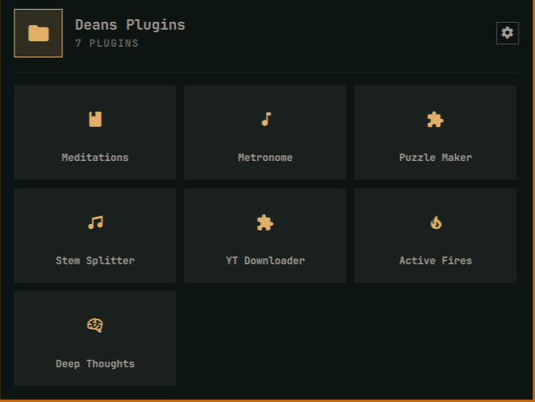

<div align="center">

# 📁 Plugin Folders

### Fold the clutter. Keep every plugin one click away.

Turn a crowded Omarchy top bar into a small set of colorful launcher folders—without sacrificing native plugin windows, settings, or behavior.

[](https://omarchy.org/)
[](https://github.com/dlpwaters/omarchy-plugin-folders)
[](#privacy-and-safety)
[](LICENSE)



</div>

## One folder instead of seven bar icons

Plugin Folders gives you repeatable, color-coded launchers for the plugins you already use. Open a folder, choose a plugin, and its normal panel or one-click action runs exactly as it would from the bar.

- Create as many independent folders as you need.
- Choose from 12 expressive icons and 10 accent colors.
- Start typing as soon as a folder opens to filter its launchers, use the arrow keys to move, then press Enter to open one.
- Select several plugins and apply the whole change at once.
- Search, select all visible results, or clear them in one click.
- Preserve native popups, action widgets, services, timers, and inline settings.
- Restore the original section, nearby position, and complete bar entry.
- Delete a folder safely—every member returns to the bar automatically.
- Keep Omarchy structural widgets protected from accidental hiding.

## Install

```bash
omarchy plugin add https://github.com/dlpwaters/omarchy-plugin-folders.git --enable --yes
~/.config/omarchy/plugins/io.github.dlpwaters.plugin-folders/folderctl bootstrap
omarchy restart shell
```

The first folder appears beside the workspace switcher. Click it, open **Manage**, select the plugins you want inside, then choose **Apply**.

Right-click a folder icon to jump directly into its organizer. Use **New folder** to add another launcher with its own name, icon, color, and members.

## What happens to a plugin?

| When added to a folder | When removed from a folder |
| --- | --- |
| Its standalone bar icon is removed. | Its complete saved bar entry returns. |
| Its native `BarWidget.qml` stays alive under the folder icon. | Temporary keepalive state is removed. |
| A folder tile forwards the plugin's normal left click. | Its original settings and relative position are preserved. |
| Its own panel, action, IPC, timers, and services keep working. | No plugin data is deleted or reset. |

Batch changes are validated before either state file is written. If one selected plugin is invalid, the entire operation is rejected instead of leaving a half-updated folder.

## Update

```bash
omarchy plugin update io.github.dlpwaters.plugin-folders --yes
omarchy restart shell
```

## Remove safely

Restore every assigned plugin before uninstalling:

```bash
~/.config/omarchy/plugins/io.github.dlpwaters.plugin-folders/folderctl restore-all
omarchy plugin remove io.github.dlpwaters.plugin-folders --yes
omarchy restart shell
```

`restore-all` removes the folder widgets and returns every member to its saved bar location.

## Privacy and safety

Plugin Folders is local-first. It has no account, telemetry, analytics, network service, or cloud storage.

- State is stored at `${XDG_STATE_HOME:-~/.local/state}/omarchy-plugin-folders/state.json`.
- Shell changes happen only after an explicit create, apply, restore, or delete action.
- A last-operation safety copy is kept beside `shell.json` as `shell.json.plugin-folders.bak`.
- First-party `omarchy.*` and structural bar widgets cannot be placed in folders.
- The helper uses an exclusive lock and atomic file replacement for concurrent changes.

As with every Omarchy shell plugin, review the source before installing: third-party plugins execute inside the unsandboxed `omarchy-shell` process.

## Requirements

- Omarchy Quattro with third-party shell plugin support; tested on `4.0.0-1`.
- Python 3 standard library for the local `folderctl` state helper.
- No additional packages, privileged access, or network connection after installation.

## Diagnostics and development

```bash
# Check saved state against the active bar configuration
~/.config/omarchy/plugins/io.github.dlpwaters.plugin-folders/folderctl doctor

# Validate the manifest and entry points
omarchy plugin validate ~/.config/omarchy/plugins/io.github.dlpwaters.plugin-folders

# Run the regression suite
python -m unittest discover \
  ~/.config/omarchy/plugins/io.github.dlpwaters.plugin-folders/tests -v

# Lint QML
qmllint -I /usr/share/omarchy/shell \
  ~/.config/omarchy/plugins/io.github.dlpwaters.plugin-folders/BarWidget.qml \
  ~/.config/omarchy/plugins/io.github.dlpwaters.plugin-folders/Panel.qml \
  ~/.config/omarchy/plugins/io.github.dlpwaters.plugin-folders/Service.qml
```

## License

MIT © 2026 David Waters. See [LICENSE](LICENSE).
